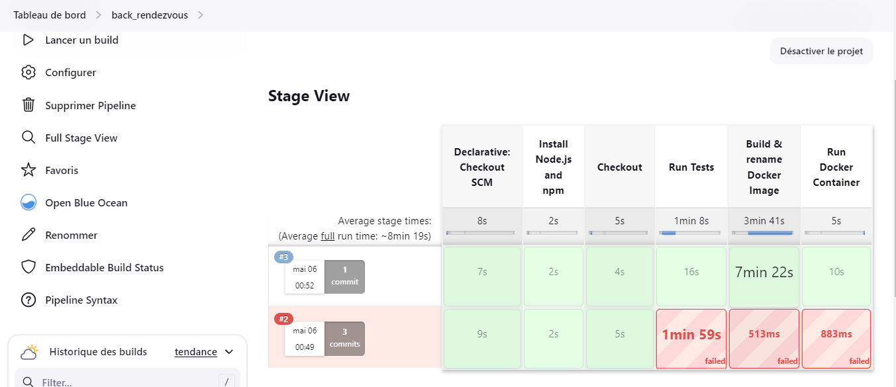
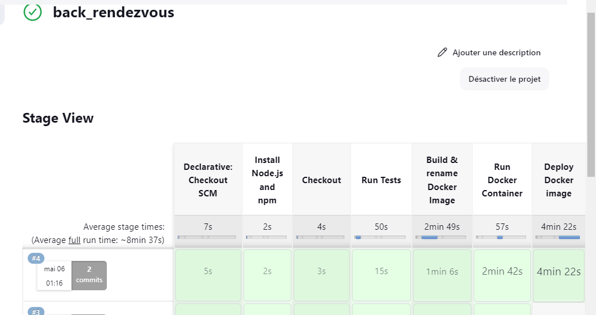

# Pipeline ci 
## Run with jest 


## stage push to docker 





------------------------------
### deploy docker-compose 


------------------------------

# kubernet deploy image docker 


## init k8s de bd image 


## start de k8s de bd image 


## use database medirendez 


## prb de connexion entre image de back et image le bd 


```
-.env :
# MySql Environment
#MYSQL_HOST=db
MYSQL_PORT=3306
MYSQL_DATABASE=
MYSQL_USER=root
MYSQL_PASSWORD=root
MYSQL_DATABASE=medirendez


-db.js:

 host: process.env.MYSQL_HOST || "db",
      port: parseInt(process.env.MYSQL_PORT) || 3306, // Convertir en entier
      username: process.env.MYSQL_USER || "root",
      password: process.env.MYSQL_PASSWORD || "root",
      database: process.env.MYSQL_DATABASE || "medirendez",
```


